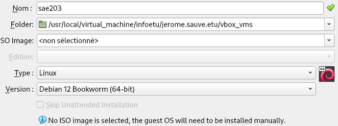
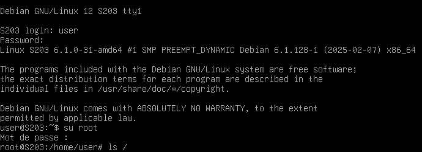
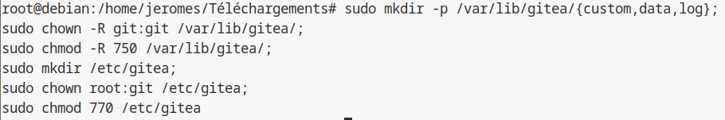
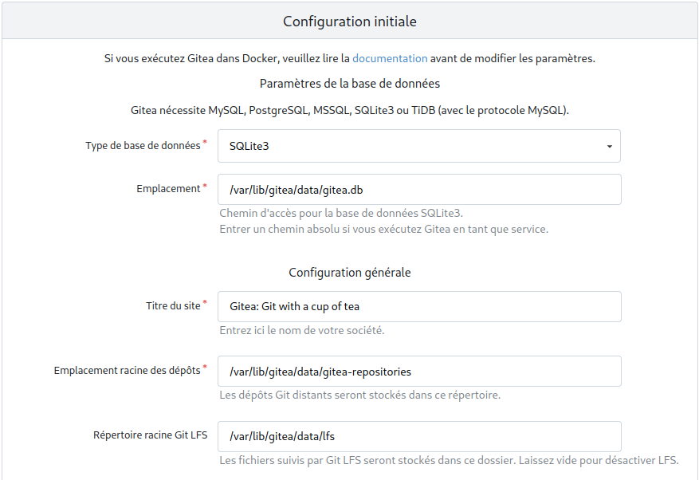
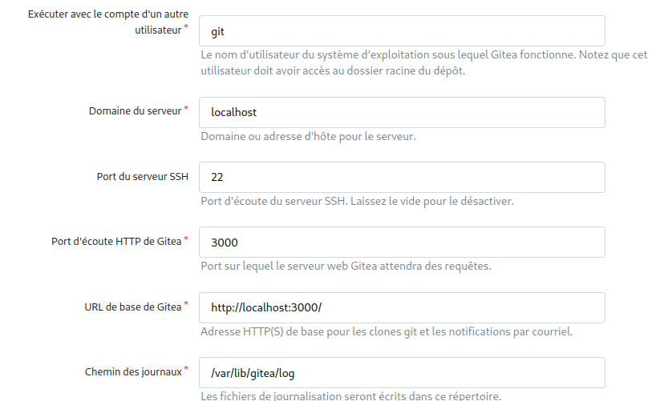
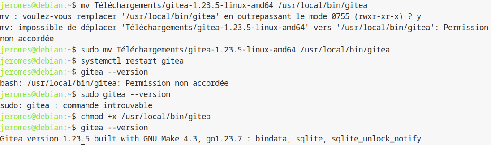

## Semaine 1 : Préparation VM par **pré-configuration**

### 1^ère^ partie

En discutant avec nos amis, nous avons choisi de créer un groupe de 2 (avec le feu vert du professeur). Puis on a commencé à travailler.

### 2^ème^ Partie : Préparation d'une machine virtuelle Debian

Dans cette partie, nous avons mis en commun nos réponses et expériences pour avoir un rapport cohérent. Nous avons principalement fait des manipulations qu'il nous a déjà été donné d'apprendre au cours du premier semestre concernant l'installation de machines virtuelles via Virtual Box. 




Nous avons ensuite installé un fichier iso de Debian 12 64-bit. En lançant la machine, nous procédons à l'installation manuelle, en choisissant :

* La localisation de la machine : France.
* La langue par défaut utilisée : Français.
* Le nom d'hôte de la machine : serveur.
* Le nom de domaine : non renseigné.
* les nom et mot de passe de l'utilisateur root : root/root.
* les nom et mot de passe du premier compte utilisateur : User/user.
* On choisit de ne pas partitionner en plusieurs parties le disque de stockage de la machine.
* On choisit l'adresse du miroir que notre machine utilisera pour gérer les paquets : debian.polytech-lille.fr.
* On choisit les logiciels à installer par défaut : 
  *  environnement de bureau Debian
  *  MATE
  *  serveur web
  *  serveur SSH
  *  utilitaires usuels du système

L'installation est maintenant terminée et on est prêts à utiliser la machine virtuelle.

#### Questions sur la préparation de la VM:

1. le "64-bit" de "Debian 64-bit" signifie qu'il s'agit de debian pour un processeur 64 bits.  
*source* :  
[Debian.org](https://www.debian.org/ports/index.fr.html)

2. La configuration réseau par défaut est NAT. Pour trouver cela nous avons ouvert les menus **Configurations**, Puis **Réseau**.

3. le fichier xml contenant la configuration de notre machine se nomme *nom_machine*.vbox. On le voit en lisant le fichier, la première ligne désigne son type de document ``` <?xml version="1.0" ?>```. 

4. Le document vbox ajoute en commentaire les façons de modifier la configuration de la machine. En effet, faire des manipulations directement sur le fichier peut être dangereux, même sans que la machine ne soit en route. Pour modifier la configuration de la machine, on peut : 
    * Utiliser VBox Manager.
    * Utiliser le VirtualBox Manager GUI.


#### Questions sur l'installation de l'OS:

 1. Une fichier ISO est un format de fichier qui renvoie à une image disque, identique à un support optique(CD-ROM,DVD), et ce sans avoir besoin de lecteur optique.
 2. MATE et GNOME sont des environnements de bureau utilisés sous Linux.
 3. Un serveur web est un serveur recevant des requêtes du World Wide Web via Internet ou via intranet, requêtes utilisant le protocole HTTP.
 4. un serveur SSH, signifiant Secure Shell, est un terminal sécurisé pour la gestion des serveurs Linux. Avec le Shell, on peut communiquer avec des machines ou des serveurs avec les manipulations nécessaires. On peut donc administre les serveurs Linux, que ce soit physiquement, ou à distance.
 5. Un serveur mandataire(proxy en anglais) est un serveur informatique qui permet l'émission et la réception de requêtes entre un client et un serveur. Les serveurs mandataires sont utile pour la sécurisation des sytèmes d'information avec ses fonctionnalités d'anonymat, de mémoire cache ou de journalisation des données.


### 3^ème^ Partie : Préparation du système

Pour accorder les droits sudo à un compte utilisateur user, il est tout d'abord nécessaire de se connecter en tant que superutilisateur root avec; depuis le terminal, la commande ```su root``` suivi de la saisie du mot de passe de root. À partir d'ici, plusieurs choix sont possibles, comme éditer le fichier /etc/sudoers avec la ligne ```user = ALL(ALL:ALL) ALL```. Cette règle indique que l'on donne les droits sur n'importe quelle machine que cet utilisateur utilise (premier ALL), en prenant les droits de tous les utilisateurs et groupes (deuxième et troisème ALL), et le droit d'exécuter toutes les commandes (dernier ALL). Un autre moyen est d'utiliser la commande ```usermod -aG sudo user```, ce qui ajoute user au groupe sudo, ce qui permettra à user d'utiliser la commande sudo après une reconnexion.

On peut vérifier l'appartenance au groupe sudo de user avec la commande ```groups [user]```, qui nous listera tous les groupes auxquels user est membre.

Un problème qui reste à régler avec notre machine virtuelle est que l'écran possède une taille fixe, ce qui peut nuire au confort d'utilisation de celle-ci.
Pour cela, avec Virtual Box, et la machine lancée, on insère l'image cd des additions invitées qui nous permettra de régler ce problème. Si on ne possède pas le fichier iso, Virtual Box nous propose un fichier à télécharger puis insérer. L'image CD inséré, on peut monter le cd avec la commande : 
``` sudo mount /dev/cdrom /mnt```
et ensuite installer les suppléments avec la commande :
``` sudo /mnt/VBoxLinuxAdditions.run```
Après un redémarrage de la machine, on peut ainsi changer la résolution de l'écran depuis Système>Préférences>Matériel>Affichage.

#### Questions :

1. Notre VM utilise amd64, on trouve cette information avec la commande ```uname -r``, qui donne des informations sur le système que l'on utilise.

2. Les suppléments invités aident à mieux utiliser notre machine virtuelle. nottament en améliorant les peformances de notre machine, et en facilitant le partage des fichiers de la machine virtuelle.  
*source* :  
[Oracle.com](https://docs.oracle.com/cd/E26217_01/E35193/html/qs-guest-additions.html)

3. La commande mount permet de gérer les partitions de notre machine. Dans ce cas spécifique on s'en sert pour installer les suppléments invités, qui se trouvent sur le CD.  
*source* :  
[ubuntu-fr.org](https://doc.ubuntu-fr.org/mount_fstab)

### 4^ème^ Partie : À propos de la distribution Debian

1. Debian est un système d'exploitation pour GNU/Linux, ayant une distribution libre et non commerciale : elle est accessible à tous de façon à ce que la communauté puisse coopérer pour améliorer et maintenir Debian le mieux possible. Son nom vient des noms "debra" et "ian", appartenant au dévelopeur principal du projet et à sa compagne.  
*sources* :  
[Présentation de Debian / Wiki / Debian-facile](https://debian-facile.org/doc:debian)  
[Chapitre 1. Le projet Debian](https://www.debian.org/doc/manuals/debian-handbook/the-debian-project.fr.html#sect.what-is-debian)  

2. La durée minimale est de 3 ans, la LTS est de 5 ans et la ELTS est de 10 ans.  
*sources* :  
[Debian -- Les versions de Debian][Ref1]  
[fr/LTS - Debian Wiki](https://www.debian.org/releases/index.fr.html)  
[fr/LTS/Extended - Debian Wiki](https://wiki.debian.org/fr/LTS/Extended) 

3. La prise en charge de Mise à jour de sécurité par Debian s'arrête après 3 ans. Suite à cela l'équipe de LTS prends le relais, puis ensuite ELTS s'en charge. Ces mises à jour peuvent donc continuer jusqu'à 10 ans au maximum : pendant 3 ans par Debian, puis pendant 2 ans par les bénévoles du projet LTS, puis pendant 5 ans par Freexian.  
*sources* :  
[Debian -- Les versions de Debian][Ref1]  
[fr/LTS - Debian Wiki](https://www.debian.org/releases/index.fr.html)  
[fr/LTS/Extended - Debian Wiki](https://wiki.debian.org/fr/LTS/Extended) 

4. Debian a au minimum trois versions entretenues : testing, stable et unstable.
*sources* :  
[Debian -- Les versions de Debian][Ref1]

5. Les noms de code des versions de Debian sont des références à des personnages de Toy Story, car Bruce Perens a pris la tête du projet et il travaillait pour Pixar à ce moment.  
*sources* :  
[Chapitre 3. Les versions de Debian](https://www.debian.org/doc/manuals/project-history/releases.fr.html)

6. La version bullseye gérait 10 architectures.  
*sources* :  
[Debian -- Informations sur la version « Bullseye » de Debian](https://www.debian.org/releases/bullseye/)

7. La première version avec un nom de code a été Buzz (Debian 1.1). Elle date du 17 juin 1996. Elle est aujourd'hui obsolète et n'est plus entretenue.  
*sources* :  
[Chapitre 3. Les versions de Debian](https://www.debian.org/doc/manuals/project-history/releases.fr.html)

8. Le dernier nom de code attribué est Trixie (Debian 13), annoncée le 31 décembre 2024. Elle est aujourd'hui en version testing.  
*sources* :  
[Debian -- Les versions de Debian][Ref1]  
[Debian -- Actualités -- Publication de l'installateur Debian Trixie Alpha 1](https://www.debian.org/devel/debian-installer/News/2024/20241231.fr.html)

[Ref1]:https://www.debian.org/releases/index.fr.html

### 5^ème^ Partie :  Installation préconfigurée
Il est possible par certains moyens d'automatiser l'installation de notre machine Debian 12, afin d'installer par défaut les applications que l'on souhaite, de créer les utilisateurs, en résumé de ne pas avoir à se soucier des étapes vues lors de l'installation manuelle.

L'archive donnée par le corps enseignant permet de procéder à une installation automatisée. 
La première chose à faire est de remplacer l'emplacement de l'identifiant par un identifiant généré aléatoirement valide pour débuter l'installation. On le fait grâce à la commande :
```
sed -i -E "s/(--iprt-iso-maker-file-marker-bourne-sh).*$/\1=$(cat
/proc/sys/kernel/random/uuid)/" S203-Debian12.viso
```
En lisant ```/proc/kernel/random/uuid```, on recupère un identifiant généré aléatoirement par le noyeau de la machine. Cette commande utilise donc un sed pour remplacer l'emplacement de l'identifiant par la valeur aléatoire obtenue par le cat.

L'identifiant généré peut se voir à la première ligne du document S203-Debian12.viso.


à partir de là on peut donc insérer le fichier .viso dans le lecteur optique de la VM, l'installation automatique est maintenant possible.
Cependant ,lancer directement l'installation nous donne une machine sans les paquets importants que nous sélectionnons lors de l'installation manuelles. Comme l'on peut voir ici : 



En particulier comme l'on voit ci-dessus, la machine n'a pas de partie graphique, dû à la non installation de MATE par exemple. De plus il nous manque des fonctionnalités, comme l'appel à la commande sudo. Des problèmes pareils peuvent être réglés manuellement, mais il est d'autant plus intéressant et pratique de revenir en arrière et de s'intéresser à la manipulation des fichiers de notre archive afin de régler ces problèmes en amont de l'installation. 
Ainsi il est important de modifier le document preseed.cfg. Dans la partie installation meta-paquetages : à la ligne 82 de la commande tasksel, il nous suffit d'ajouter le paquet mate-desktop à la fin de la ligne.

Ensuite, on modifie le fichier vboxpostinstall.sh, qui est un script s'éxécutant après installation. On y ajoute les lignes de commande suivantes afin d'ajouter les fonctionnalités que l'on souhaite : 

  
  
  Notre machine est alors prête à être utilisée pour la suite de la SAÉ.


## Semaine 2 : Apprentissage de balisage léger avec Markdown

Nous avons choisi d\'utiliser et d\'apprendre Markdown pour ce projet. Pour aider à l'apprendre nous avons crée un document dans lequel on a noté ce que l'on a appris pendant les séances d'autonomie. Nous avons réussi à nous familariser avec Mardown sans trop de difficultés. Nous avons de même pu apprendre à transformer un fichier markdown en pdf, méthode que nous avons renseigné dans le readme.


## Semaine 3 : Recherches/études applications clientes

### 1^ère^ Partie: configuration globale de git
Pour cette partie nous utiliserons la commande ```git config --global```.  
Cette commande permet donc de modifier les paramètres d'un dépôt git. 
la commande s'écrivant en local à l'origine, nous utilisons l'option ```--global``` afin que nos dépôts soient sous la même configuration au niveau de l'utilisateur, au sein du fichier *~/.gitconfig*. 
  
> Il est aussi possible de modifier les paramètres aà l'échelle du dépôt par défaut, éditant le fichier .git/config ou à l'échelle de la machine avec l'option --system, éditant le fichier /etc/config.

| Commande | Description |
|--|--|
|```git config --global user.name "Jérôme Sauvé"```| change le nom d'utilisateur que l'on trouvera dans les logs du dépôt.|
|```git config --global user.email "jerome.sauve.etu@univ-lille.fr"```|modifie l'adresse mail utilisateur associée au user.name.|
|```git config --global init.branchDefault "master"```|définit le nom de la branche par défaut, sans précisions un message à l'attention de l'utilisateur sera affiché à l'initialisation d'un dépôt git.|

### 2^ème^ Partie : Les interfaces graphiques pour git

Afin d'obtenir une vision plus claire d'un dépôt git, on peut utiliser différentes applications. Parmi celles-ci :
 * Gitk : un navigateur de dépôt graphique, qui permet donc une visualisation des activités concernant notre dépôt. Codé en tcl/tk, tcl pour *Tool Command Language* qui correspond à la partie écriture des scripts, et tk l'extension allant de pair qui gère la partie graphique. L'application, une fois installée, se lance depuis le terminal avec la commande gitk une fois placé au niveau du dépôt git.Ainsi l'interface suivant nous apparait :


Il s'agit d'un logiciel qui possède beaucoup de fonctionnalités, que ce soit l'affichage des branches du dépôt, la recherche de commits, avec précision sur les dates possibles ou non, et de les trier, ce qui en fait donc un logiciel général permettant d'appréhender les mécanismes de git.

 * Git gui : interface graphique codée à partir des mêmes languages que Gitk, elle peut se lancer de la même manière, à partir du terminal. L'application nous affiche alors cette interface graphique : 


L'interface de git gui pétant peut-être un peu plus épuré et accessible que gitk, il est seulement utilisé pour de l'annotation, la génération de blames ou de commit. Ainsi le logiciel git gui seul n'est pas optimal pour une gestion complète d'un dépôt.

### 3^ème^ Partie : Installons autre chose et comparons.

Bien que Gitk et Git gui puissent être des outils satisfaisants, ce ne sont peut être pas les meilleurs outils selon l'utilisateur : l'interface de Gitk pourrait ne pas être assez confortable d'utilisation, et git gui pourrait manquer de fonctionnalités pour être un outil indispensable. 
Ainsi plusieurs ressources en ligne, tel que [git-scm.com](https://git-scm.com/downloads/guis?os=linux), sont disponibles pour trouver des interfaces conçues différemment.

Pour cette SAÉ, notre choix s'est porté sur UnGit. Ses avantages sont que c'est un logiciel complètement gratuit, facilement installable depuis son terminal et son utilisation est similaire aux deux précédents logiciels.

Pour ce faire, il nous suffit de rentrer ces lignes de commande : 
```
sudo apt install npm
sudo -H npm install -g ungit
```
une fois les paquets installés, on lance le logiciel avec la commande ```ungit```, de la même façon que gitk et Git gui, qui ouvrira à l'extérieur du terminal, sur un navigateur web, cette interface :


## Semaine 4 : Istallation de Gitea

### Installation de Gitea


##### À propos de Gitea

 1. Gitea est un logiciel permettant de mettre en place un service git sur sa machine (au lieu que le service soit hébergé sur un serveur distant), visant à être simple d'utilisation et d'installation. Il permet donc l'organisation de projets à travers différents utilisateurs et machines en temps réel.

 2. Gitea est un logiciel comparable à :

   * GitHub : Un logiciel de service git hébergé sur les serveurs de Git, permettant lui aussi la collaboration en temps réel sur un projet.

   * GitLab : un  logiciel de service git hebergé sur sa machine, il offre accès à tous les outils de DevOps pour ses projets.

 3. Un fork est une copie du code source d'un logiciel, à partir de laquelle un développement différent de l'original peut commencer.

 4. Gitea est à l'origine un fork de Gogs, ce logiciel existe toujours indépendamment de gitea.

 
#### Installation

Pour commencer notre installation du service Gitea, nous allons nous appuyer sur la méthode d'installation pour téléchargement du binaire décrite [ici](https://docs.gitea.io/en-us/install-from-binary/). En premier lieu nous choisissons la version de gitea que nous allons installer. Pour permettre une mise à jour de la version du service nous prendrons donc la version 1.23.0 de Gitea. Donc pour notre système qui est pour rappel l'architecture Debian 12 64-bits, nous téléchargerons le fichier  gitea-1.23.0-linux-amd64.


Puis, pour vérifier notre clé GPG, qui nous permet une sécurité de nos données en chiffrant les données entrantes et à l'inverse chiffrer les données sortantes, nous téléchargeons le fichier .asc et vérifions la clé gpg de notre service avec les commandes suivantes :


Une fois la vérification faite, il nous faut préparer la machine à recevoir le service réseau. 
Nous allons créer un nouvel utilisateur nommé git, via la commande :


Ensuite pour préparer l'environnement à accueillir le service, nous créons dans l'arborescence :

|emplacement | propriétaire utilisateur| droits | propriétaire groupe| droits | droits autres |
|---|---|---|---|---|---|
|/var/lib/gitea|git|rwx|git|r-x|---|
|/etc/gitea|root|rwx|git|rwx|---|



À noter que les droits seront amenés à être changés une fois l'installation complète et le service fonctionnel.


Une fois Gitea bien installé, nous nous y connectons en saisissant dans un navigateur l'adresse http://localhost:3000. 

La première chose que l'on nous demande est de faire la paramétrage web de gitea, que l'on fait comme ci-suit :





Une fois le paramétrage fait, il ne nous reste plus qu'à créer le compte qui sera administrateur de notre service, et ainsi Gitea est désormais prêt à l'emploi sur notre machine.


### Mise à jour

Le service Gitea peut être mis à jour, que ce soit vers une version plus récente ou plus ancienne, même si ce dernier n'est pas conseillé, la structure des données d'une version à l'autre pouvant varier, cela pourrait rendre le service inopérant.

#### Mise à jour par téléchargement d'un nouveau binaire

 1. La version actuelle de Gitea est la version 1.23.0, nous pouvons le constater avec la commande :

   

 2. Pour mettre à jour le binaire, il nous faut d'abord arrêter le service avec la commande ``` systemctl stop gitea ```. Il est ensuite nécessaire de télécharger le binaire de la version voulue comme nous l'avons fait lors de l'installation, que l'on placera dans le dossier temporaire /tmp/gitea, soit on peut directement exécuter la commande ``` wget -O /tmp/gitea https://dl.gitea.io/gitea/VERSION/gitea-VERSION-linux-amd64 ``` depuis notre terminal. N'ayant pas trouvé la version 1.24-dev par la recherche du binaire ou par la commande wget, nous avons décidé de mettre à jour le service à la version **1.23.5** à la place.
    Ensuite, , après avoir supprimé le binaire de notre ancienne version du service, nous déplaçons le nouveau binaire à l'emplacement /usr/local/bin. Après avoir rendu le dossier /usr/local/bin/gitea, nous pouvons faire ``` systemctl restart gitea ```. Une fois les manipulations faites, nous pouvons constater la mise à jour faite.
  
   

### Tests d'utilisation

Pour utiliser gitea nous avons d'abord créé un dépôt d'essai. 

La première étape étant d'y téléverser notre rapport, nous avons donc procédé de la même manière que par l'utilisation de GitHub. 

Le service de gitea ayant été installé sur le profil de Jérôme Sauvé depuis son ordinateur personnel, il nous a donc fallu que Alexandre Maintier puisse accéder au dépôt. Ce qui ne peut pas se faire comme cela car notre dépôt gitea tourne en localhost. Ce qui fait que notre dépôt est invisible depuis l'extérieur, donc impossible de l'ajouter comme cela.
Nous avons pu explorer une piste, sans succès malheureusement, qui est d'utiliser la redirection de port pour partager depuis l'ordinateur hôte, à savoir en cherchant dans le navigateur de l'appareil externe l'addresse *http://IpPublicMachineHote:3000*. Cependant peut être car la redirection de port de l'appareil hôte n'était pas bien configuré, nous n'avons pas réussi à obtenir un résultat pour effectuer la manipulation.


