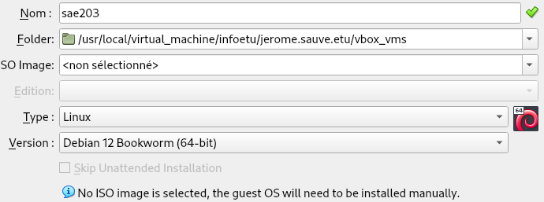
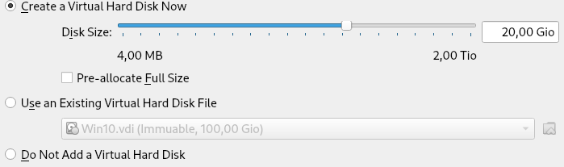
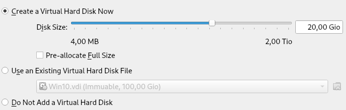
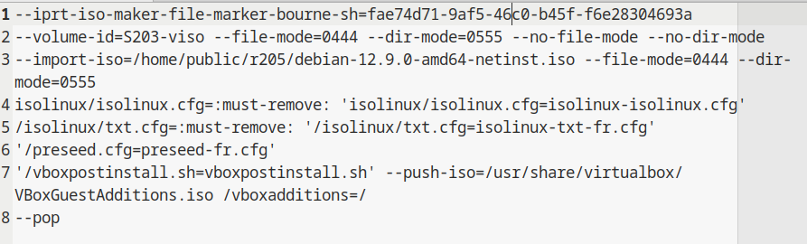
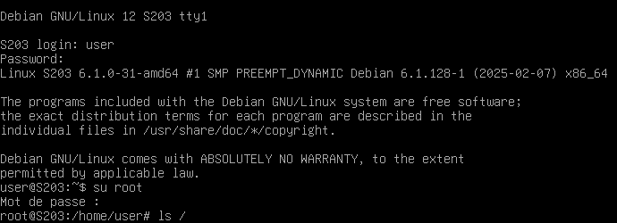
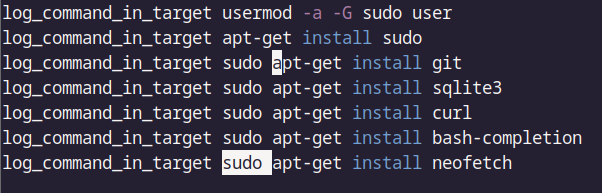

## Semaine 1 : Préparation VM par **pré-configuration**

### 1^ère^ partie

En discutant avec nos amis, nous avons choisi de créer un groupe de 2 (avec le feu vert du professeur). Puis on a commencé à travailler.

### 2^ème^ Partie : Préparation d'une machine virtuelle Debian

Dans cette partie, nous avons mis en commun nos réponses et expériences pour avoir un rapport cohérent. Nous avons principalement fait des manipulations qu'il nous a déjà été donné d'apprendre au cours du premier semestre concernant l'installation de machines virtuelles via Virtual Box. 







Nous avons ensuite installé un fichier iso de Debian 12 64-bit. En lançant la machine, nous procédons à l'installation manuelle, en choisissant : 
 * La localisation de la machine : *France*.
 * La langue par défaut utilisée : *Français*.
 * Le nom d'hôte de la machine : *serveur*.
 * Le nom de domaine : *non renseigné*.
 * les nom et mot de passe de l'utilisateur root : *root/root*.
 * les nom et mot de passe du premier compte utilisateur : *User/user*.
 * On choisit de ne pas partitionner en plusieurs parties le disque de stockage de la machine.
 * On choisit l'adresse du miroir que notre machine utilisera pour gérer les paquets : *debian.polytech-lille.fr*.
 * On choisit les logiciels à installer par défaut : 
   *  environnement de bureau Debian
   *  MATE
   *  serveur web
   *  serveur SSH
   *  utilitaires usuels du système
  
L'installation est maintenant terminée et on est prêts à utiliser la machine virtuelle.

#### Questions sur la préparation de la VM:

1. le "64-bit" de "Debian 64-bit" signifie qu'il s'agit de debian pour un processeur 64 bits.  
*source* :  
[Debian.org](https://www.debian.org/ports/index.fr.html)

2. La configuration réseau par défaut est NAT. Pour trouver cela nous avons ouvert les menus **Configurations**, Puis **Réseau**.

3. le fichier xml contenant la configuration de notre machine se nomme *nom_machine*.vbox. On le voit en lisant le fichier, la première ligne désigne son type de document ``` <?xml version="1.0" ?>```. 

4. Le document vbox ajoute en commentaire les façons de modifier la configuration de la machine. En effet, faire des manipulations directement sur le fichier peut être dangereux, même sans que la machine ne soit en route. Pour modifier la configuration de la machine, on peut : 
    * Utiliser VBox Manager.
    * Utiliser le VirtualBox Manager GUI.


#### Questions sur l'installation de l'OS:

 1. Une fichier ISO est un format de fichier qui renvoie à une image disque, identique à un support optique(CD-ROM,DVD), et ce sans avoir besoin de lecteur optique.
 2. MATE et GNOME sont des environnements de bureau utilisés sous Linux.
 3. Un serveur web est un serveur recevant des requêtes du World Wide Web via Internet ou via intranet, requêtes utilisant le protocole HTTP.
 4. un serveur SSH, signifiant Secure Shell, est un terminal sécurisé pour la gestion des serveurs Linux. Avec le Shell, on peut communiquer avec des machines ou des serveurs avec les manipulations nécessaires. On peut donc administre les serveurs Linux, que ce soit physiquement, ou à distance.
 5. Un serveur mandataire(proxy en anglais) est un serveur informatique qui permet l'émission et la réception de requêtes entre un client et un serveur. Les serveurs mandataires sont utile pour la sécurisation des sytèmes d'information avec ses fonctionnalités d'anonymat, de mémoire cache ou de journalisation des données.


### 3^ème^ Partie : Préparation du système

Pour accorder les droits sudo à un compte utilisateur user, il est tout d'abord nécessaire de se connecter en tant que superutilisateur root avec; depuis le terminal, la commande ```su root``` suivi de la saisie du mot de passe de root. À partir d'ici, plusieurs choix sont possibles, comme éditer le fichier /etc/sudoers avec la ligne ```user = ALL(ALL:ALL) ALL```. Cette règle indique que l'on donne les droits sur n'importe quelle machine que cet utilisateur utilise (premier ALL), en prenant les droits de tous les utilisateurs et groupes (deuxième et troisème ALL), et le droit d'exécuter toutes les commandes (dernier ALL). Un autre moyen est d'utiliser la commande ```usermod -aG sudo user```, ce qui ajoute user au groupe sudo, ce qui permettra à user d'utiliser la commande sudo après une reconnexion.

On peut vérifier l'appartenance au groupe sudo de user avec la commande ```groups [user]```, qui nous listera tous les groupes auxquels user est membre.

Un problème qui reste à régler avec notre machine virtuelle est que l'écran possède une taille fixe, ce qui peut nuire au confort d'utilisation de celle-ci.
Pour cela, avec Virtual Box, et la machine lancée, on insère l'image cd des additions invitées qui nous permettra de régler ce problème. Si on ne possède pas le fichier iso, Virtual Box nous propose un fichier à télécharger puis insérer. L'image CD inséré, on peut monter le cd avec la commande : 
``` sudo mount /dev/cdrom /mnt```
et ensuite installer les suppléments avec la commande :
``` sudo /mnt/VBoxLinuxAdditions.run```
Après un redémarrage de la machine, on peut ainsi changer la résolution de l'écran depuis Système>Préférences>Matériel>Affichage.

#### Questions :

1. Notre VM utilise amd64, on trouve cette information avec la commande ```uname -r``, qui donne des informations sur le système que l'on utilise.

2. Les suppléments invités aident à mieux utiliser notre machine virtuelle. nottament en améliorant les peformances de notre machine, et en facilitant le partage des fichiers de la machine virtuelle.  
*source* :  
[Oracle.com](https://docs.oracle.com/cd/E26217_01/E35193/html/qs-guest-additions.html)

3. La commande mount permet de gérer les partitions de notre machine. Dans ce cas spécifique on s'en sert pour installer les suppléments invités, qui se trouvent sur le CD.  
*source* :  
[ubuntu-fr.org](https://doc.ubuntu-fr.org/mount_fstab)

### 4^ème^ Partie : À propos de la distribution Debian

1. Debian est un système d'exploitation pour GNU/Linux, ayant une distribution libre et non commerciale : elle est accessible à tous de façon à ce que la communauté puisse coopérer pour améliorer et maintenir Debian le mieux possible. Son nom vient des noms "debra" et "ian", appartenant au dévelopeur principal du projet et à sa compagne.  
*sources* :  
[Présentation de Debian / Wiki / Debian-facile](https://debian-facile.org/doc:debian)  
[Chapitre 1. Le projet Debian](https://www.debian.org/doc/manuals/debian-handbook/the-debian-project.fr.html#sect.what-is-debian)  

2. La durée minimale est de 3 ans, la LTS est de 5 ans et la ELTS est de 10 ans.  
*sources* :  
[Debian -- Les versions de Debian][Ref1]  
[fr/LTS - Debian Wiki](https://www.debian.org/releases/index.fr.html)  
[fr/LTS/Extended - Debian Wiki](https://wiki.debian.org/fr/LTS/Extended) 

3. La prise en charge de Mise à jour de sécurité par Debian s'arrête après 3 ans. Suite à cela l'équipe de LTS prends le relais, puis ensuite ELTS s'en charge. Ces mises à jour peuvent donc continuer jusqu'à 10 ans au maximum : pendant 3 ans par Debian, puis pendant 2 ans par les bénévoles du projet LTS, puis pendant 5 ans par Freexian.  
*sources* :  
[Debian -- Les versions de Debian][Ref1]  
[fr/LTS - Debian Wiki](https://www.debian.org/releases/index.fr.html)  
[fr/LTS/Extended - Debian Wiki](https://wiki.debian.org/fr/LTS/Extended) 

4. Debian a au minimum trois versions entretenues : testing, stable et unstable.
*sources* :  
[Debian -- Les versions de Debian][Ref1]

5. Les noms de code des versions de Debian sont des références à des personnages de Toy Story, car Bruce Perens a pris la tête du projet et il travaillait pour Pixar à ce moment.  
*sources* :  
[Chapitre 3. Les versions de Debian](https://www.debian.org/doc/manuals/project-history/releases.fr.html)

6. La version bullseye gérait 10 architectures.  
*sources* :  
[Debian -- Informations sur la version « Bullseye » de Debian](https://www.debian.org/releases/bullseye/)

7. La première version avec un nom de code a été Buzz (Debian 1.1). Elle date du 17 juin 1996. Elle est aujourd'hui obsolète et n'est plus entretenue.  
*sources* :  
[Chapitre 3. Les versions de Debian](https://www.debian.org/doc/manuals/project-history/releases.fr.html)

8. Le dernier nom de code attribué est Trixie (Debian 13), annoncée le 31 décembre 2024. Elle est aujourd'hui en version testing.  
*sources* :  
[Debian -- Les versions de Debian][Ref1]  
[Debian -- Actualités -- Publication de l'installateur Debian Trixie Alpha 1](https://www.debian.org/devel/debian-installer/News/2024/20241231.fr.html)

[Ref1]:https://www.debian.org/releases/index.fr.html

### 5^ème^ Partie :  Installation préconfigurée
Il est possible par certains moyens d'automatiser l'installation de notre machine Debian 12, afin d'installer par défaut les applications que l'on souhaite, de créer les utilisateurs, en résumé de ne pas avoir à se soucier des étapes vues lors de l'installation manuelle.

L'archive donnée par le corps enseignant permet de procéder à une installation automatisée. 
La première chose à faire est de remplacer l'emplacement de l'identifiant par un identifiant généré aléatoirement valide pour débuter l'installation. On le fait grâce à a commande :
```
sed -i -E "s/(--iprt-iso-maker-file-marker-bourne-sh).*$/\1=$(cat
/proc/sys/kernel/random/uuid)/" S203-Debian12.viso
```
$$peut etre expliquer comment la commande génère l'id$$
L'identifiant généré se voir à la première ligne du document S203-Debian12.viso.



à partir de là on peut donc insérer le fichier .viso dans le lecteur optique de la VM, l'installation automatique est maintenant possible.
Cependant ,lancer directement l'installation nous donne une machine sans les paquets importants que nous sélectionnons lors de l'installation manuelles. Comme l'on peut voir ici : 



En particulier comme l'on voit ci-dessus, la machine n'a pas de partie graphique, dû à la non installation de MATE par exemple. De plus il nous manque des fonctionnalités, comme l'appel à la commande sudo. Des problèmes pareils peuvent être réglés manuellement, mais il est d'autant plus intéressant et pratique de revenir en arrière et de s'intéresser à la manipulation des fichiers de notre archive afin de régler ces problèmes en amont de l'installation. 
Ainsi il est important de modifier le document preseed.cfg.
On modifie à deux endroits : 
  * Dans la partie installation meta-paquetages : à la ligne 82 de la commande tasksel, il nous suffit d'ajouter le paquet mate-desktop à la fin de la ligne.
  * Puis dans la partie custom commands, ajouter les lignes suivantes, qui seront donc exécutées en dernière partie d'installation : 
  $$trompé dans la méthode, les commandes sont à mettre dans vboxpostinstall.sh de souvenir, à vérifier$$

  
  
  Notre machine est alors prête à être utilisée pour la suite de la SAÉ.
