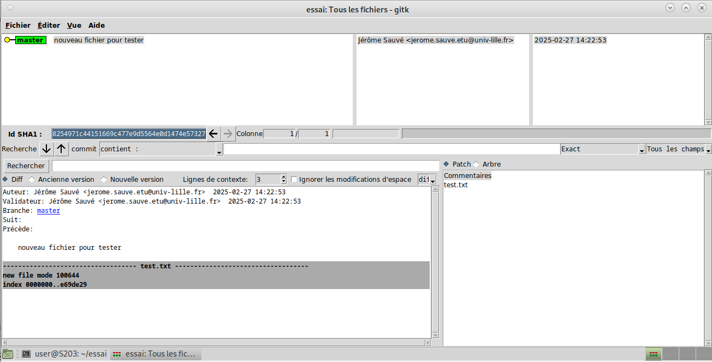
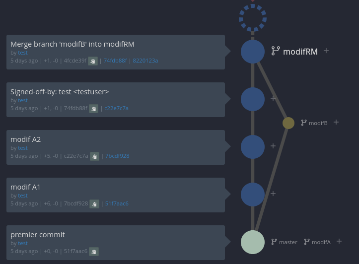

## Semaine 3 : Recherches/études applications clientes

### 1^ère^ Partie: configuration globale de git
Pour cette partie nous utiliserons la commande ```git config --global```.  
Cette commande permet donc de modifier les paramètres d'un dépôt git. 
la commande s'écrivant en local à l'origine, nous utilisons l'option ```--global``` afin que nos dépôts soient sous la même configuration au niveau de l'utilisateur, au sein du fichier *~/.gitconfig*. 
  
> Il est aussi possible de modifier les paramètres aà l'échelle du dépôt par défaut, éditant le fichier .git/config ou à l'échelle de la machine avec l'option --system, éditant le fichier /etc/config.

| Commande | Description |
|--|--|
|```git config --global user.name "Jérôme Sauvé"```| change le nom d'utilisateur que l'on trouvera dans les logs du dépôt.|
|```git config --global user.email "jerome.sauve.etu@univ-lille.fr"```|modifie l'adresse mail utilisateur associée au user.name.|
|```git config --global init.branchDefault "master"```|définit le nom de la branche par défaut, sans précisions un message à l'attention de l'utilisateur sera affiché à l'initialisation d'un dépôt git.|

### 2^ème^ Partie : Les interfaces graphiques pour git

Afin d'obtenir une vision plus claire d'un dépôt git, on peut utiliser différentes applications. Parmi celles-ci :
 * Gitk : un navigateur de dépôt graphique, qui permet donc une visualisation des activités concernant notre dépôt. Codé en tcl/tk, tcl pour *Tool Command Language* qui correspond à la partie écriture des scripts, et tk l'extension allant de pair qui gère la partie graphique. L'application, une fois installée, se lance depuis le terminal avec la commande gitk une fois placé au niveau du dépôt git.Ainsi l'interface suivant nous apparait :



Il s'agit d'un logiciel qui possède beaucoup de fonctionnalités, que ce soit l'affichage des branches du dépôt, la recherche de commits, avec précision sur les dates possibles ou non, et de les trier, ce qui en fait donc un logiciel général permettant d'appréhender les mécanismes de git.

 * Git gui : interface graphique codée à partir des mêmes languages que Gitk, elle peut se lancer de la même manière, à partir du terminal. L'application nous affiche alors cette interface graphique : 


L'interface de git gui pétant peut-être un peu plus épuré et accessible que gitk, il est seulement utilisé pour de l'annotation, la génération de blames ou de commit. Ainsi le logiciel git gui seul n'est pas optimal pour une gestion complète d'un dépôt.

### 3^ème^ Partie : Installons autre chose et comparons.

Bien que Gitk et Git gui puissent être des outils satisfaisants, ce ne sont peut être pas les meilleurs outils selon l'utilisateur : l'interface de Gitk pourrait ne pas être assez confortable d'utilisation, et git gui pourrait manquer de fonctionnalités pour être un outil indispensable. 
Ainsi plusieurs ressources en ligne, tel que [git-scm.com](https://git-scm.com/downloads/guis?os=linux), sont disponibles pour trouver des interfaces conçues différemment.

Pour cette SAÉ, notre choix s'est porté sur UnGit. Ses avantages sont que c'est un logiciel complètement gratuit, facilement installable depuis son terminal et son utilisation est similaire aux deux précédents logiciels.

Pour ce faire, il nous suffit de rentrer ces lignes de commande : 
```
sudo apt install npm
sudo -H npm install -g ungit
```
une fois les paquets installés, on lance le logiciel avec la commande ```ungit```, de la même façon que gitk et Git gui, qui ouvrira à l'extérieur du terminal, sur un navigateur web, cette interface :


