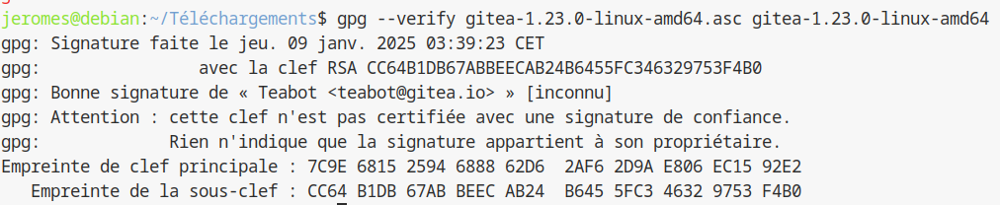
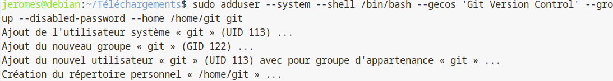
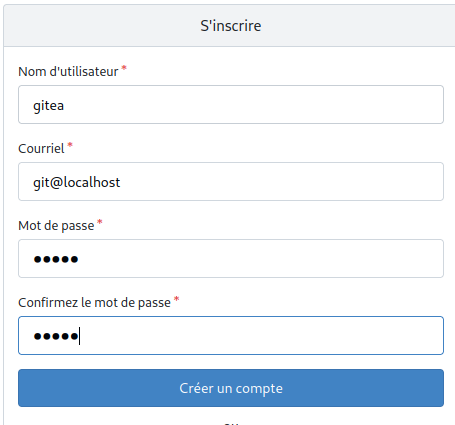

## Semaine 4 : Istallation de Gitea

### Installation de Gitea


##### À propos de Gitea

 1. Gitea est un logiciel permettant de mettre en place un service git sur sa machine (au lieu que le service soit hébergé sur un serveur distant), visant à être simple d'utilisation et d'installation. Il permet donc l'organisation de projets à travers différents utilisateurs et machines en temps réel.

 2. Gitea est un logiciel comparable à :

   * GitHub : Un logiciel de service git hébergé sur les serveurs de Git, permettant lui aussi la collaboration en temps réel sur un projet.

   * GitLab : un  logiciel de service git hebergé sur sa machine, il offre accès à tous les outils de DevOps pour ses projets.

 3. Un fork est une copie du code source d'un logiciel, à partir de laquelle un développement différent de l'original peut commencer.

 4. Gitea est à l'origine un fork de Gogs, ce logiciel existe toujours indépendamment de gitea.

 
#### Installation

Pour commencer notre installation du service Gitea, nous allons nous appuyer sur la méthode d'installation pour téléchargement du binaire décrite [ici](https://docs.gitea.io/en-us/install-from-binary/). En premier lieu nous choisissons la version de gitea que nous allons installer. Pour permettre une mise à jour de la version du service nous prendrons donc la version 1.23.0 de Gitea. Donc pour notre système qui est pour rappel l'architecture Debian 12 64-bits, nous téléchargerons le fichier  gitea-1.23.0-linux-amd64.


Puis, pour vérifier notre clé GPG, qui nous permet une sécurité de nos données en chiffrant les données entrantes et à l'inverse chiffrer les données sortantes, nous téléchargeons le fichier .asc et vérifions la clé gpg de notre service avec les commandes suivantes :




Une fois la vérification faite, il nous faut préparer la machine à recevoir le service réseau. 
Nous allons créer un nouvel utilisateur nommé git, via la commande :



Ensuite pour préparer l'environnement à accueillir le service, nous créons dans l'arborescence :

|emplacement | propriétaire utilisateur| droits | propriétaire groupe| droits | droits autres |
|---|---|---|---|---|---|
|/var/lib/gitea|git|rwx|git|r-x|---|
|/etc/gitea|root|rwx|git|rwx|---|


À noter que les droits seront amenés à être changés une fois l'installation complète et le service fonctionnel.


Une fois Gitea bien installé, nous nous y connectons en saisissant dans un navigateur l'adresse http://localhost:3000. 

La première chose que l'on nous demande est de faire la paramétrage web de gitea, que l'on fait comme ci-suit :


Une fois le paramétrage fait, il ne nous reste plus qu'à créer le compte qui sera administrateur de notre service, et ainsi Gitea est désormais prêt à l'emploi sur notre machine.




### Mise à jour

Le service Gitea peut être mis à jour, que ce soit vers une version plus récente ou plus ancienne, même si ce dernier n'est pas conseillé, la structure des données d'une version à l'autre pouvant varier, cela pourrait rendre le service inopérant.

#### Mise à jour par téléchargement d'un nouveau binaire

 1. La version actuelle de Gitea est la version 1.23.0, nous pouvons le constater avec la commande :

   

 2. Pour mettre à jour le binaire, il nous faut d'abord arrêter le service avec la commande ``` systemctl stop gitea ```. Il est ensuite nécessaire de télécharger le binaire de la version voulue comme nous l'avons fait lors de l'installation, que l'on placera dans le dossier temporaire /tmp/gitea, soit on peut directement exécuter la commande ``` wget -O /tmp/gitea https://dl.gitea.io/gitea/VERSION/gitea-VERSION-linux-amd64 ``` depuis notre terminal. N'ayant pas trouvé la version 1.24-dev par la recherche du binaire ou par la commande wget, nous avons décidé de mettre à jour le service à la version **1.23.5** à la place.
    Ensuite, , après avoir supprimé le binaire de notre ancienne version du service, nous déplaçons le nouveau binaire à l'emplacement /usr/local/bin. Après avoir rendu le dossier /usr/local/bin/gitea, nous pouvons faire ``` systemctl restart gitea ```. Une fois les manipulations faites, nous pouvons constater la mise à jour faite.
  
   

### Tests d'utilisation

Pour utiliser gitea nous avons d'abord créé un dépôt d'essai. 

La première étape étant d'y téléverser notre rapport, nous avons donc procédé de la même manière que par l'utilisation de GitHub. 

Le service de gitea ayant été installé sur le profil de Jérôme Sauvé depuis son ordinateur personnel, il nous a donc fallu que Alexandre Maintier puisse accéder au dépôt. Ce qui ne peut pas se faire comme cela car notre dépôt gitea tourne en localhost. Ce qui fait que notre dépôt est invisible depuis l'extérieur, donc impossible de l'ajouter comme cela.
Nous avons pu explorer une piste, sans succès malheureusement, qui est d'utiliser la redirection de port pour partager depuis l'ordinateur hôte, à savoir en cherchant dans le navigateur de l'appareil externe l'addresse *http://IpPublicMachineHote:3000*. Cependant peut être car la redirection de port de l'appareil hôte n'était pas bien configuré, nous n'avons pas réussi à obtenir un résultat pour effectuer la manipulation.


